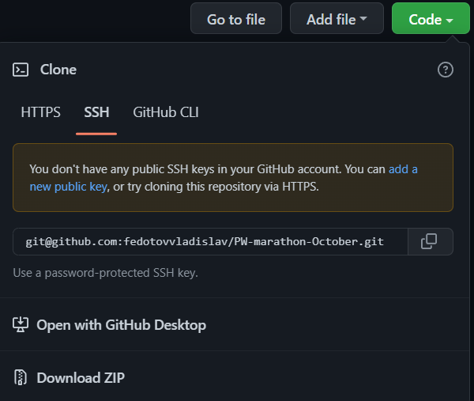

## Скрипт парсинга прогресса по марафону Perfect World(обновлено до 01.07.2023)

### Стек

Скрипт написан на Python 3.10

### Используемые библиотеки

1. selenium ver. 4.9.0
2. python-dotenv ver. 0.20.0
3. openpyxl ver. 3.0.10
4. undetected_chromedriver ver. 3.5.0

### Предназначение

Скрипт парсит информацию со страницы https://pw.mail.ru/supermarathon2.php.
Скрипт актуален для игроков использующих большое количество аккаунтов для минимизации ручного входа на каждый аккаунт и отслеживания своего прогресса.

### Начало работы
Установить Python 3.10. Ссылка на инструкцию https://pythonru.com/baza-znanij/skachat-i-ustanovit-python-na-windows-10
Так же возможно установка из магазина Microsoft: https://learn.microsoft.com/ru-ru/windows/python/beginners

#### Первый запуск:
1. Скачать архив с файлами из репозитория

2. Распаковать архив в удобное для себя расположение(например, Рабочий стол)
3. Запустить файл "firstrun.bat"
4. Создать файл .env,
(Примечание 1: Если скрыты расширения файлов необходимо включить отображение,
инструкция: https://fixx.one/os/windows/how-to-enable-file-extension-in-windows-10-8-7-xp.
Примечание 2: Открытие и заполнение файла возможно через блокнот)
5. Заполнить файл .env в соответствии с примером(файл .env.template):
5.1. TOTAL_ACCOUNTS = количество аккаунтов данные которых необходимо парсить
5.2. NAME_N(где N - номер аккаунта. Для аккаунта номер 17 будет NAME_17) = Имя персонажа
5.3. EMAIL_N = Адрес электронной почты(для авторизации через VK ID необходимо указать номер телефона)
5.4. PWD_N = Пароль от эл.почты / VK
5.5. TYPE_N = Тип авторизации. Возможные значения(чувствительно к регистру):
5.5.1. vk - Авторизация через VK
5.5.2. mail - Авторизация через почту mail.ru
5.5.3. gmail - Авторизация через аккаунт Google
5.5.4. straight - Авторизация напрямую через всплывающее окно авторизации(не через соц.сети)
6. Запустить файл "firstrun.bat"

#### Последующие запуски:
1. Запустить файл "startapp.bat"

### Особенности и рекомендации
1. Авторизация через VK зачастую запрашивает ввод капчи, для этого авторизация осуществляется не в фоновом режиме, рекомендуется записывать аккаунт VK одним из первых для авторизации для того чтобы ввести капчу и заниматься своими делами.
2. Авторизация через Google аккаунт так же необходима не в фоновом режиме, программа не находит необходимые кнопки в фоне
3. Авторизация через почту mail.ru и прямая авторизация доступна в фоновом режиме. Окно браузера вылезать не будет.

